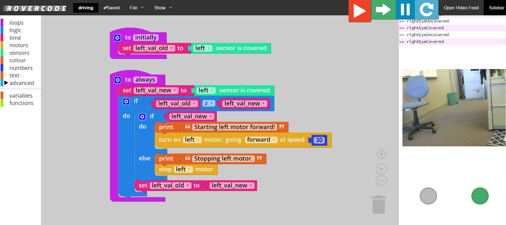

Architecture
========================

These codebases make up rovercode. Click on their names to view their individual documentation.

- rovercode_: the service that runs on the rover
- rovercode-web_: the web application 

The web application runs in the browser, and communicates with the rover over a local WiFi connection.

rovercode
------------

This is the service that runs on the rover. It receives commands from the web application and controls the motors.
It also monitors the sensors and reports their values to the web application.

This service is a `Flask <http://flask.pocoo.org/>`_ application written in Python 2 
(we have `a ticket <https://github.com/rovercode/rovercode/issues/153>`_ to upgrade it to Python 3).

It implements a REST API to receive motors commands.It also hosts a websocket server and emits sensor values 
via a websocket to its client, the web application.

rovercode-web
---------------

This is the web application that runs in the cloud. It has the Mission Control application as well as authentication, 
user management, rover management, and block diagram management.

rovercode-web is a Django application written in Python 3.

Mission Control
~~~~~~~~~~~~~~~~~

The Mission Control application is the where students design their code. They pull `Blockly <https://developers.google.com/blockly/>`_ blocks from the library on the 
left to construct their code, then run it with the controls in the upper right. The Blockly blocks are transpiled to 
Javascript, which is executed in a sandboxed Javascript interpreter in the browser. The transpiled Javascript makes calls
to the rover REST API to control its motors, and it listens for the rover's sensor data as a client of the rover's websocket 
server.

Hardware
----------

Custom PCB
~~~~~~~~~~~~~
The rover uses a custom PCB to interface an off-the-shelf single-board computer to the motors and sensors. Its design files
are available `here on Upverter <https://upverter.com/rovercode/>`_.

The first version of the board (the DIP) is compatible with the Next Thing Co. CHIP single-board computer. The second version
(HAT) supports all Raspberry Pi single-board computers versions 2 and later (including the Zero and Zero W).

Also in our Upverter account is the design of PCB for the infrared sensors.

Chassis
~~~~~~~~~~

The 3D CAD design of our chassis is soon to be open-source. Design file coming soon.

.. _rovercode: https://contributor-docs.rovercode.com/rovercode/development/index.html
.. _rovercode-web: https://contributor-docs.rovercode.com/rovercode-web/development/index.html