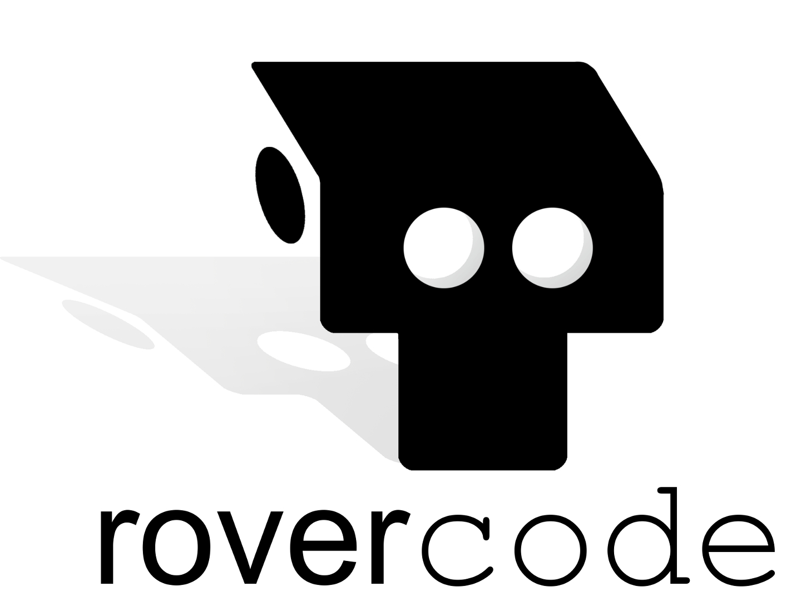

.. rovercode documentation master file, created by
   sphinx-quickstart on Sun Jun 10 14:37:41 2018.
   You can adapt this file completely to your liking, but it should at least
   contain the root `toctree` directive.
   
:License: GPLv3
:Hosted at: `<https://rovercode.com>`_ (master) and `<https://beta.rovercode.com>`_ (development)

Welcome
================
.. image:: https://badges.gitter.im/rovercode.png
      :target: chat_

We're so glad you're interested in helping make rovercode even better! Whether you have years of experience or 
you're pretty new to coding, you can make great contributions, and we are here to help and support you.

This documentation is about the creation of the rovercode platform itself; if you are a teacher or 
student using rovercode, you're probably looking for `rovercode.com <https://rovercode.com/>`_.

What is rovercode?
====================
rovercode is an open-source educational robotics platform. Students can create code that listens to the rover's 
sensors and controls its motors, then watch the rover set out to execute that code. It combines exciting robotics with 
low-barrier block-based programming, all on open-source software and hardware.

Read more at `rovercode.com <https://rovercode.com>`_.

.. image:: https://i.imgur.com/mjcBAYF.png

We are always looking for new people to help make rovercode even better.
Keep reading to learn more about rovercode and how to get started contributing to its development.

.. toctree::
   :maxdepth: 1
   :caption: Contents:

   introduction
   getting_started
   architecture
   code_of_conduct

.. _chat: https://gitter.im/rovercode/Lobby
.. _rovercode: https://contributor-docs.rovercode.com/rovercode/development/index.html
.. _rovercode-web: https://contributor-docs.rovercode.com/rovercode/development/index.html
